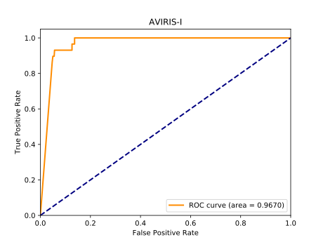
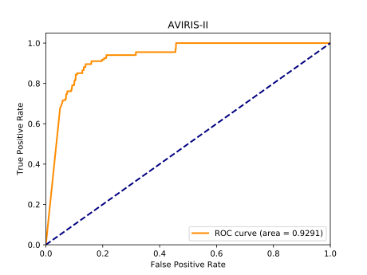

# CNND

This is a pytorch implementation of the paper *'Transferred Deep Learning for Anomaly Detection in Hyperspectral Imagery'*. The author didn't provide their source code, so I was asked to reproduce the algorithm in this paper by my co-supervisor for his experiments.

## Envirement

- pytorch 1.3
- numpy
- scipy
- sklearn

## Datasets

This implementation only support dataset with a format like `A.mat` and A should have two key like `data = A['data'] groundtruth = A['gt']/A['ground_truth']` to sotre data and labels respectively.

Here are the datasets using in this implementation:

- Training data: [Salinas with 189 bands](http://www.ehu.eus/ccwintco/index.php/Hyperspectral_Remote_Sensing_Scenes)
- Testing data: AVIRIS-I.mat, AVIRIS-II.mat

## Usage

You can train it directly using `python train.py` or test you datasets using `python eval.py` for the default setting. You should change the data path if you wana using other datasets.

## Performance

    

